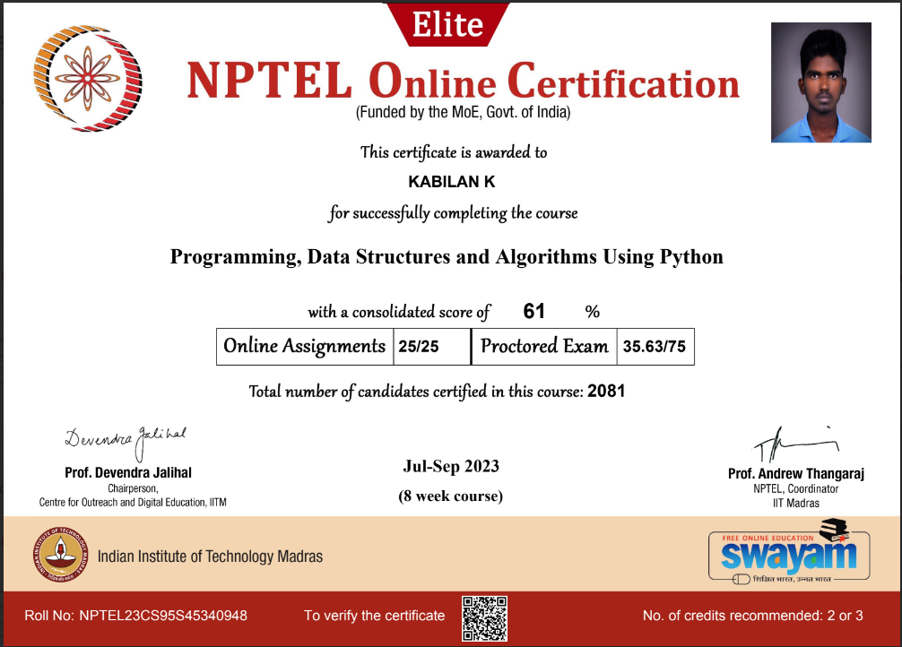

# NPTEL - Programming, Data Structures And Algorithms Using Python Course

## Overview

This repository contains my solutions and notes for the NPTEL `Programming, Data Structures And Algorithms Using Python` course. The course covers fundamental, intermediate programming, data structures, algorithms and aspects of Object-Oriented Programming.

### Course Details

- **Credit Points:** 2
- **Start Date:** 24 Jul 2023
- **End Date:** 15 Sep 2023
- **Exam Date:** 24 Sep 2023

## Topics Covered

- Week 1:
  Informal introduction to programmin, algorithms and data structures viagcd
  Downloading and installing Python
  gcd in Python: variables, operations, control flow - assignments, condition-als, loops, functions

- Week 2:
  Python: types, expressions, strings, lists, tuples
  Python memory model: names, mutable and immutable values
  List operations: slices etc
  Binary search
  Inductive function denitions: numerical and structural induction
  Elementary inductive sorting: selection and insertion sort
  In-place sorting

- Week 3:
  Basic algorithmic analysis: input size, asymptotic complexity, O() notation
  Arrays vs lists
  Merge sort
  Quicksort
  Stable sorting

- Week 4:
  Dictionaries
  More on Python functions: optional arguments, default values
  Passing functions as arguments
  Higher order functions on lists: map, lter, list comprehension

- Week 5:
  Exception handling
  Basic input/output
  Handling files
  String processing

- Week 6:
  Backtracking: N Queens, recording all solutions
  Scope in Python: local, global, nonlocal names
  Nested functions
  Data structures: stack, queue
  Heaps

- Week 7:
  Abstract datatypes
  Classes and objects in Python
  "Linked" lists: find, insert, delete
  Binary search trees: find, insert, delete
  Height-balanced binary search trees

- Week 8:
  Effcient evaluation of recursive definitions: memoization
  Dynamic programming: examples
  Other programming languages: C and manual memory management
  Other programming paradigms: functional programming

## Certification

I have successfully completed the NPTEL - Programming, Data Structures And Algorithms Using Python course. Here is my certification:

## Getting Started

1. Clone this repository: `git clone https://github.com/kabilankavi131/DSA_Using_Python.git`
2. Navigate to the specific topic folder to access the code and notes.

## Prerequisites

- Basic knowledge of Python programming language

## How to Use

- Each topic is organized in separate folders.
- Navigate to the desired topic to find relevant code and documentation.

## Contributing

Feel free to contribute by opening issues or submitting pull requests.
